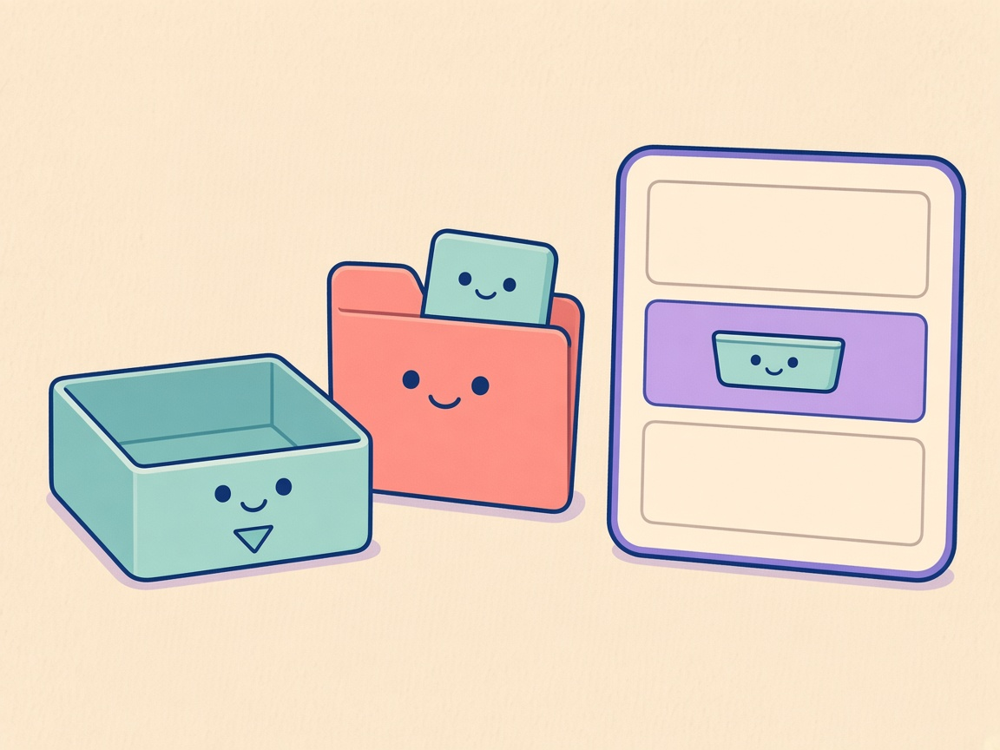
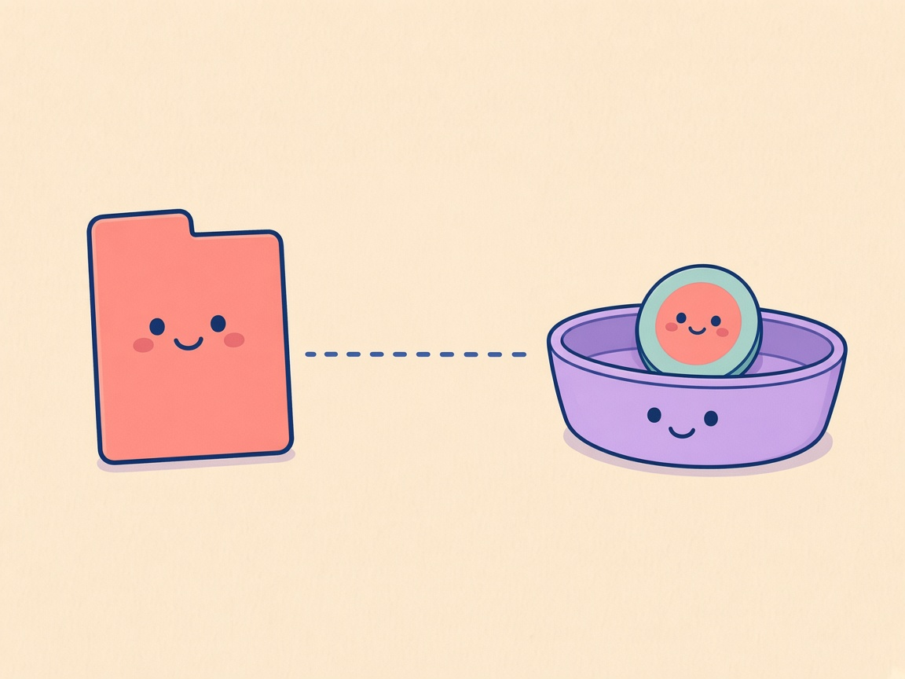

# DDock 0.11.2 What’s New

**In Ablage legen**

Comic for the [DOKK 0.11.2 release notes](0.11.2.md). Review preview: [0.11.2-comic.html](0.11.2-comic.html).

## Panel 01 — Ordnermenü

**Menü am Ordner**

> Schau ins Menü.

Downloads und angeheftete Ordner zeigen den Befehl auch für Inhalte.

## Panel 02 — Befehl wählen

**In Ablage legen**

> Nur ein Verweis.

Wähle den Befehl für den Ordner oder eine Datei darin. Nichts wird verschoben oder kopiert.

## Panel 03 — Verweis

**Der Verweis bleibt**

> Ich bleibe hier.

Auf der Ablage liegt ein Verweis. Die Datei bleibt an ihrem Ort.

## English

**Add to Shelf**

### Panel 01 — Folder menu

**Menu on the folder**

> Open the menu.

Downloads and pinned folders show the command for their contents too.

### Panel 02 — Choose the command

**Add to Shelf**

> Just a reference.

Choose it for the folder or a file inside. Nothing is moved or copied.

### Panel 03 — Reference token

**The reference stays**

> I stay put.

A token sits on the Shelf. The file stays where it lives.
