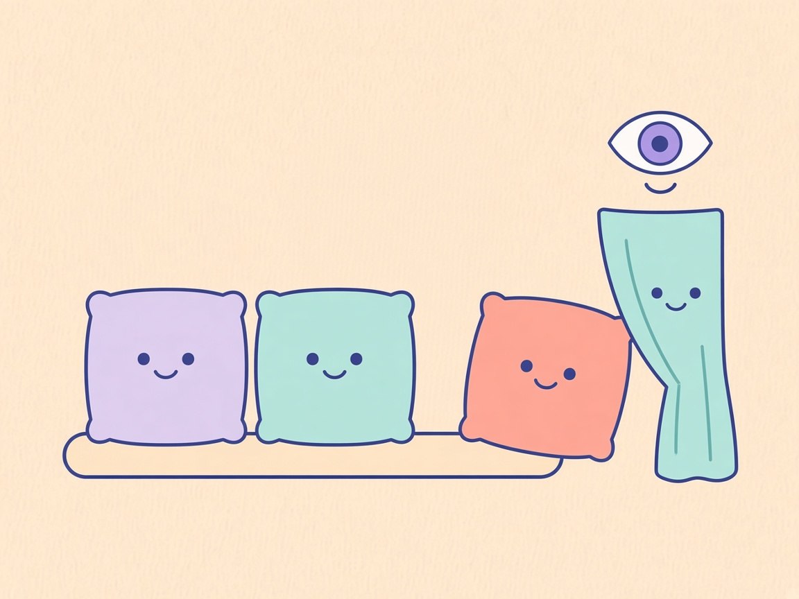
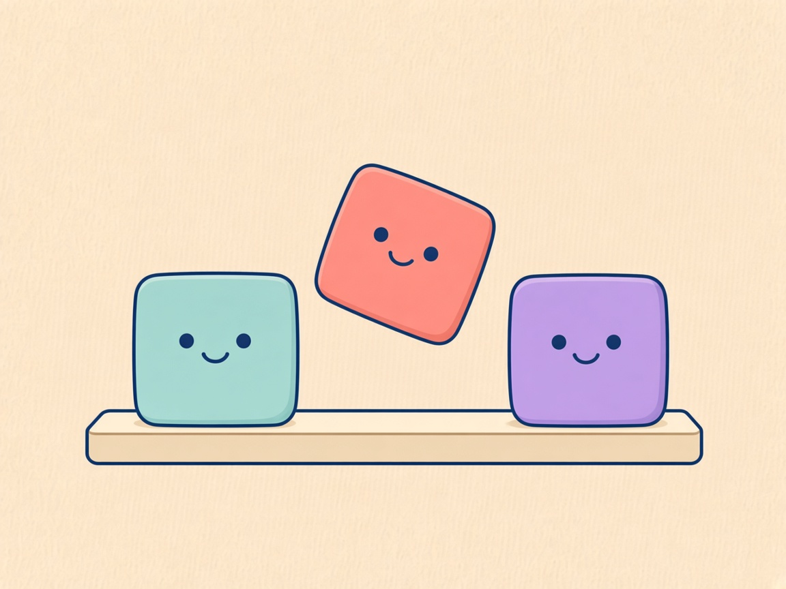

# DDock 0.13.0 What’s New

**Nur die richtigen**

Comic for the [DOKK 0.13.0 release notes](0.13.0.md). Review preview: [0.13.0-comic.html](0.13.0-comic.html).

## Panel 01 — Ausblenden

**Noch verbunden**

> Ich bin noch da.

Versteckt, aber verbunden.

## Panel 02 — Umsortieren

**Neue Reihe**

> Schieb uns um.

Ziehen sortiert die Reihe.

## Panel 03 — Backups

**Hinter dem Vorhang**

> Ich warte hinten.

Backups erst auf Wunsch.

## English

**Only the right ones**

### Panel 01 — Hide

**Still mounted**

> I am still here.

Hidden, still mounted.

### Panel 02 — Reorder

**A new order**

> Slide us along.

Drag them into new places.

### Panel 03 — Backups

**Behind the curtain**

> I wait back here.

Backups wait until you ask.
