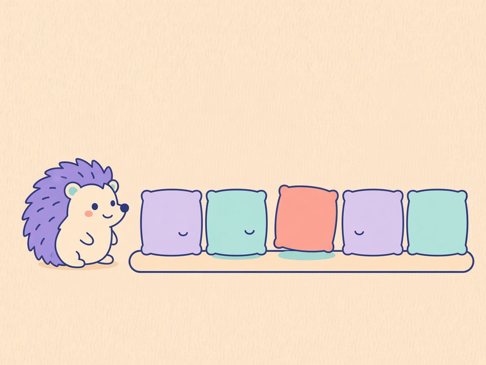
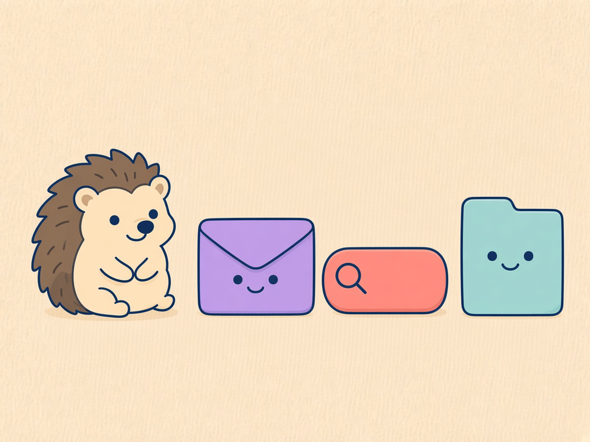
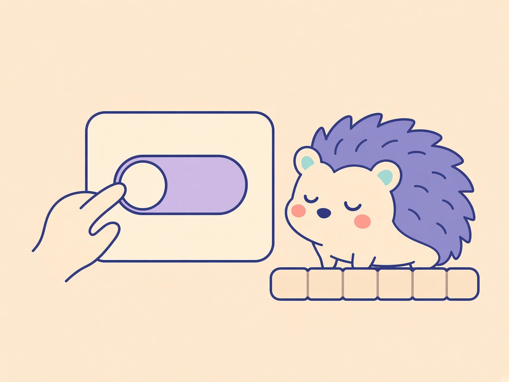

# DDock 0.13.3 What’s New

**Stiller Gast**

Comic for the [DOKK 0.13.3 release notes](0.13.3.md). Review preview: [0.13.3-comic.html](0.13.3-comic.html).

## Panel 01 — Kacheln

**Ein stiller Gast**

> Ich sehe nur die Nutzung.

Der Gast merkt, welche Kacheln genutzt werden, und nennt sie nicht.

## Panel 02 — Geschlossen

**Namen bleiben hier**

> Die lasse ich zu.

Namen, Suchtext und Dateiinhalte bleiben geschlossen. Der Igel öffnet sie nicht.

## Panel 03 — Schalter

**Du sagst Stopp**

> Ich schaue nicht mehr.

Ein Schalter unter Einstellungen › Allgemein › Datenschutz schaltet das Zuschauen sofort aus.

## English

**Quiet guest**

### Panel 01 — Tiles

**A quiet guest**

> I only see the use.

The guest notices which tiles are used, and does not name them.

### Panel 02 — Shut

**Names stay here**

> I leave these shut.

Names, search text, and file contents stay shut. The hedgehog does not open them.

### Panel 03 — Switch

**You say stop**

> I stop watching.

A switch in Settings › General › Privacy turns the watching off at once.
