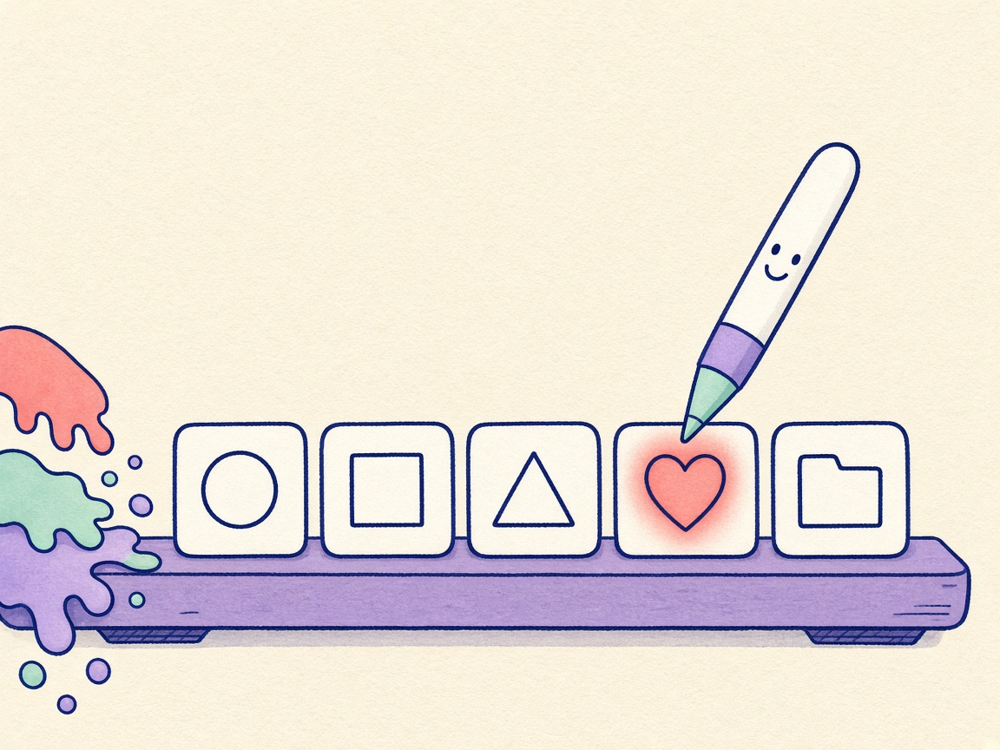
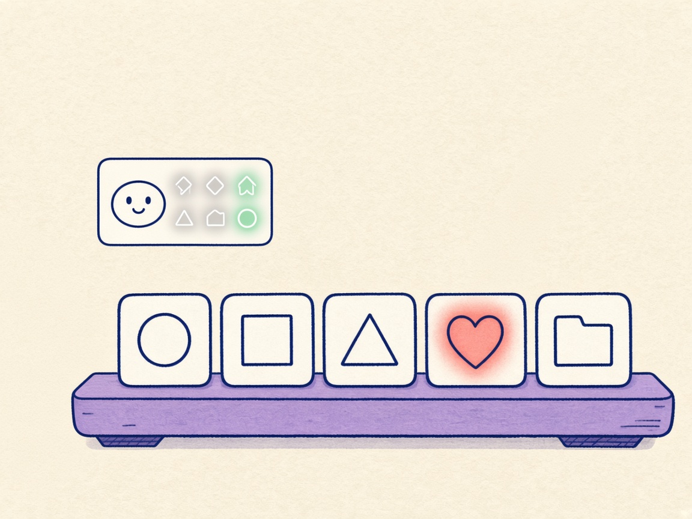
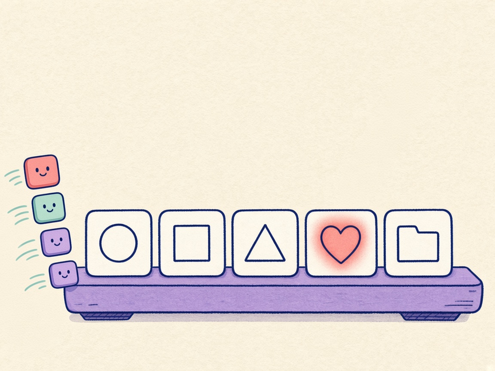

# DDock 0.14.0 What’s New

**Weiße Ruhe**

Comic for the [DOKK 0.14.0 release notes](0.14.0.md). Review preview: [0.14.0-comic.html](0.14.0-comic.html).

## Panel 01 — Linie

**Ruhige Striche**

> Schau, ich leuchte.

Bekannte Apps werden weiße Strichsymbole. Eine ohne Symbol behält ihr Icon. Zeigen und die Tastatur lassen es farbig leuchten.

## Panel 02 — Kompakt

**Kleines Raster**

> Ich bleibe klein.

Kompakt öffnet ein durchsuchbares App-Raster über der Launcher-Kachel. Das Dock bleibt an seinem Platz. Abgelegte Dateien öffnen den großen Launcher.

## Panel 03 — Wegräumen

**An die Seite**

> Ich warte am Rand.

macOS-Dock wegräumen blendet das macOS-Dock aus, macht es klein und schiebt es auf die andere Seite. Beenden stellt deine Werte zurück.

## English

**Quiet lines**

### Panel 01 — Line

**Calm lines**

> Watch me glow.

Known apps become white line glyphs. One without a glyph keeps its icon. Hover and the keyboard make it glow.

### Panel 02 — Compact

**A small grid**

> I stay small.

Compact opens a searchable app grid above the Launcher tile. The dock stays put. Dropped files open the full Launcher.

### Panel 03 — Tuck away

**Off to the side**

> I wait at the edge.

Tuck Away hides the macOS Dock, shrinks it, and slides it to the other side. Quitting puts your settings back.
