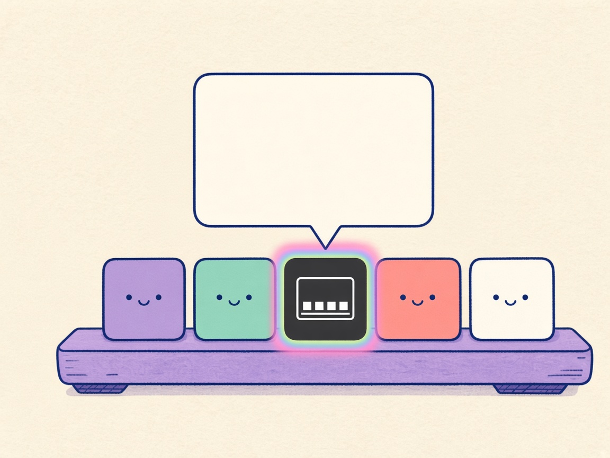
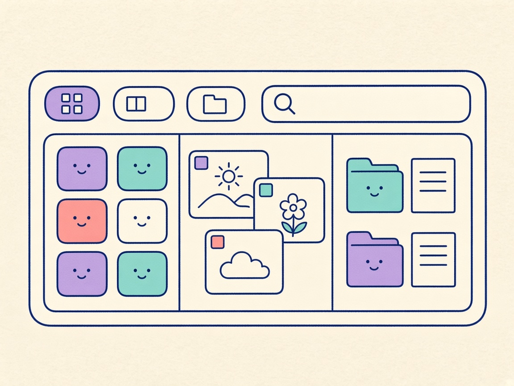
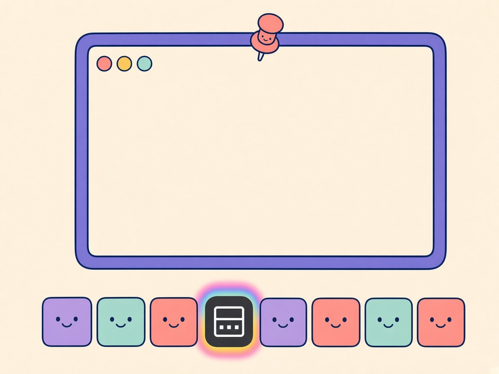

# DDock 0.19.0 What’s New

**Über der Kachel**

Comic for the [DOKK 0.19.0 release notes](0.19.0.md). Review preview: [0.19.0-comic.html](0.19.0-comic.html).

## Panel 01 — Schein

**Regenbogen**

> Schau, ich leuchte.

Die DOKK-Kachel trägt einen Regenbogen-Schein. Darüber öffnet sich eine Glasscheibe, und eine Spitze zeigt auf genau diese Kachel. Das Dock bleibt unten.

## Panel 02 — Bereiche

**Drei Bereiche**

> Alles an einem Ort.

In der Scheibe liegen drei Bereiche nebeneinander. Links bunte App-Kacheln, in der Mitte Fenster mit Bildern, rechts Ordner und Seiten. Oben drei kleine Zeichen und ein leeres Suchfeld mit Lupe.

## Panel 03 — Nadel

**Los vom Dock**

> Ich bleibe offen.

Eine Nadel hebt die Scheibe vom Dock. Sie wird ein Fenster mit drei farbigen Punkten, Kacheln, Bildern und einem Ordner. Unten bleibt die Kachel mit dem Regenbogen-Schein.

## English

**Above the tile**

### Panel 01 — Glow

**Rainbow glow**

> Watch me glow.

The DOKK tile wears a rainbow halo. A glass panel opens above it, and a tail points at that tile. The dock stays along the bottom.

### Panel 02 — Places

**Three places**

> All in one place.

Three areas share the glass: app tiles, pictured windows, then folders and pages. Three small marks and an empty search field with a magnifier sit on top.

### Panel 03 — Pin

**Off the dock**

> I stay open.

A pin lifts the glass off the dock. It becomes a window with three colored dots, tiles, pictures, and a folder. The rainbow tile stays on the dock below.
