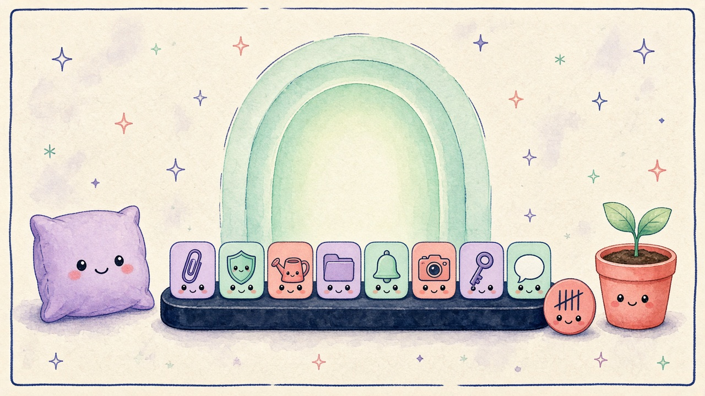
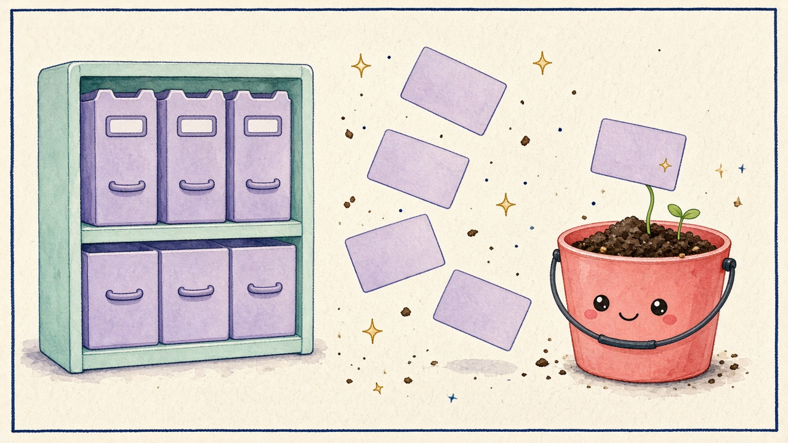

# DDock 0.5.0 What’s New

Docs-only comic for the [DDock 0.5.0 release notes](0.5.0.md). Review preview: [0.5.0-comic.html](0.5.0-comic.html).

## Panel 01 — Focus-Atmung und Schulden

**Ruhig atmen am Dock**

> Tief ein. Eins gezählt.

Focus-Atmung leuchtet sanft im Dock. Das Schulden-Meter zählt nur abgebrochene Sessions — lokal, standardmäßig aus.

## Panel 02 — Kompost

**Kompost fürs Shelf**

> Später. Noch nicht weg!

Alternde Shelf-Einträge wandern in den Kompost. Zurückholen frischt das Alter — Originaldateien bleiben.

## Panel 03 — Icon-Gossip

**Icons tratschen leise**

> Hörst du das auch?

Opt-in KI-Tratsch zwischen Pins. Intensität von leichtem Geplapper bis eklatantem Echo — lokal mit Apple Intelligence.

## English

### Panel 01 — Focus breathing + debt

**Breathe. Stay honest.**

> Soft glow. One tallied.

Focus breathing glows softly in the dock. The debt meter counts only broken sessions — local, off by default.

### Panel 02 — Compost

**Shelf goes to compost**

> Later. Not gone yet!

Aging Shelf items move into Compost. Restoring refreshes their age — original files stay untouched.

### Panel 03 — Icon gossip

**Icons whisper gossip**

> Did you hear that?

Opt-in AI gossip between pins. Intensity from light chatter to egregious echoing — on-device Apple Intelligence.
