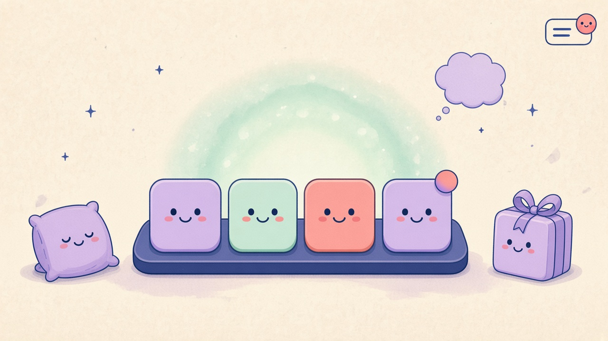
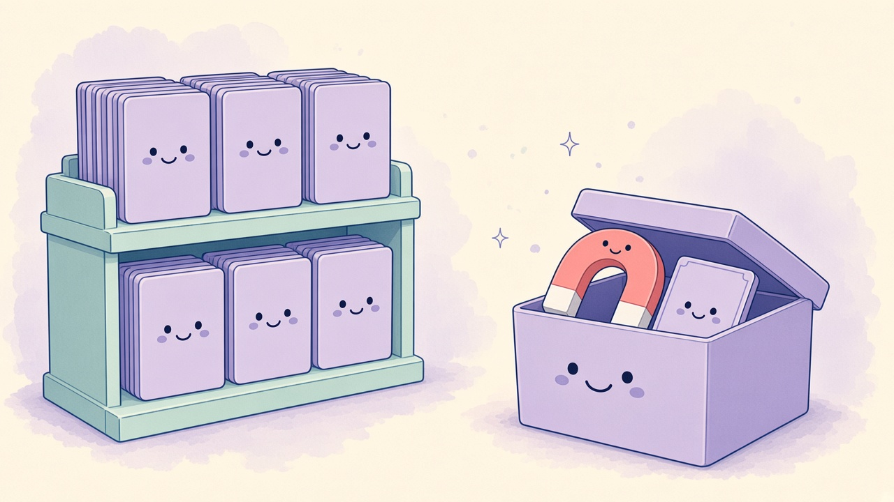

# DDock 0.6.0 What’s New

Comic for the [DDock 0.6.0 release notes](0.6.0.md). Review preview: [0.6.0-comic.html](0.6.0-comic.html).

## Panel 01 — Launcher-Filter und Suche

**Launcher räumt die Suche**

> Nur Favoriten. Eine Leiste.

Filter, Favoriten und Ort sitzen im Overflow. Robi kommt erst mit einer Query. Scroll bleibt, aktive Filter sind sichtbar und lassen sich zurücksetzen.

## Panel 02 — Update-Hinweise

**Updates winken leise**

> Hier. Wenn du Zeit hast.

Ein Hinweis auf dem Hauptdisplay, Badges in Menü und Einstellungen, ein Pip am Dock. Installation im Leerlauf bleibt aus, bis du sie anschaltest.

## Panel 03 — Aufräumen vor 1.0

**Aufräumen vor 1.0**

> Magnete kommen in die Kiste.

Einstellungen sind neu gegliedert, Atmosphere sitzt auf den gemeinsamen Karten. Magnetische Kanten und die Vor-1.0-Persönlichkeit sind abgeschaltet und landen unter Veraltet.

## English

### Panel 01 — Launcher filters and search

**Cleaner launcher search**

> Favorites only. One menu.

Type, favorites, and location live in one overflow. Robi appears only with a query. Scroll is restored; active filters show and reset.

### Panel 02 — Update awareness

**Updates tap quietly**

> Here. When you are idle.

A callout on the main display, badges in the menu and Settings, a pip on DDock glass. Idle install stays off until you turn it on.

### Panel 03 — Tidying before 1.0

**Tidying up before 1.0**

> Magnets go in the box.

Settings are regrouped, Atmosphere sits on the shared cards. Magnetic Edges and the pre-1.0 personality features are forced off under Deprecated.
