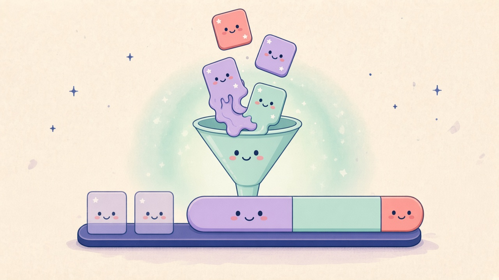
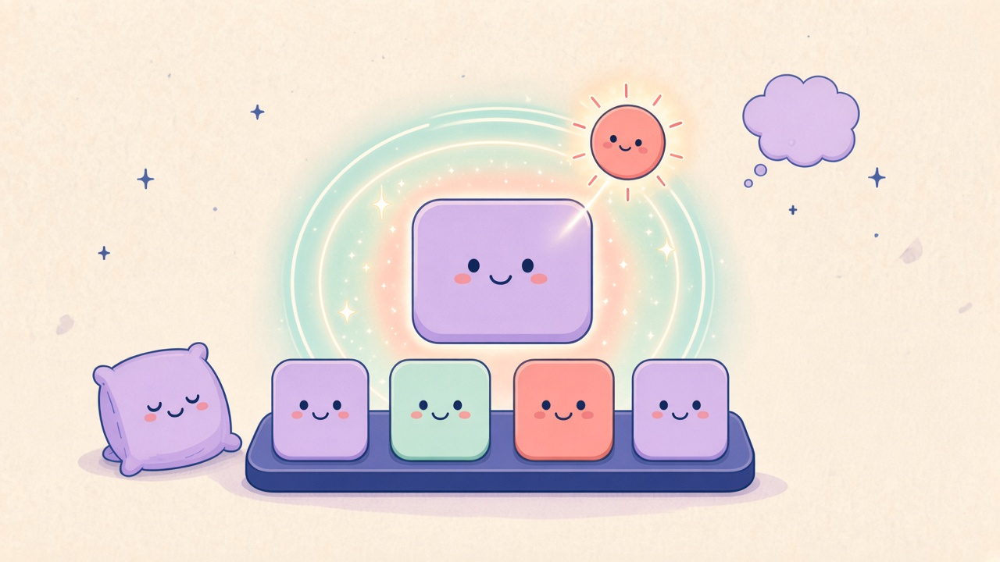

# DDock 0.8.0 What’s New

Comic for the [DDock 0.8.0 release notes](0.8.0.md). Review preview: [0.8.0-comic.html](0.8.0-comic.html).

## Panel 01 — App-Fusion-Paarung

**Zwei Apps schmelzen**

> Halt still. Jetzt schmelzen wir.

Fensterkanten halten, Icons übereinander, Peek oder Menü. Geteiltes Glas, Finder-Ordnerwerkzeuge, ein Dock-Paar.

## Panel 02 — Licht vom Fenster

**Licht vom Fenster**

> Ich leuchte, wo du bist.

Atmosphere legt einen Halo um das fokussierte Fenster. Intensität wie das Ambientlicht. Standardmäßig aus.

## Panel 03 — Peek und Dock

**Peek reicht hinüber**

> Komm, wir setzen uns.

Peek-Karten starten Fusion. Minimierte Paare sitzen als eine Kachel im Dock.

## English

### Panel 01 — App Fusion pairing

**Two apps melt**

> Hold still. Now we melt.

Dwell on window edges, stack icons, Peek, or the menu. Shared glass, Finder folder tools, one dock pair.

### Panel 02 — Window lighting

**Light from the window**

> I glow where you are.

Atmosphere draws a halo around the focused window. Intensity matches the ambient wash. Off by default.

### Panel 03 — Peek and dock

**Peek reaches over**

> Come sit with us.

Peek cards can start Fusion. Minimized pairs share one dock tile.
